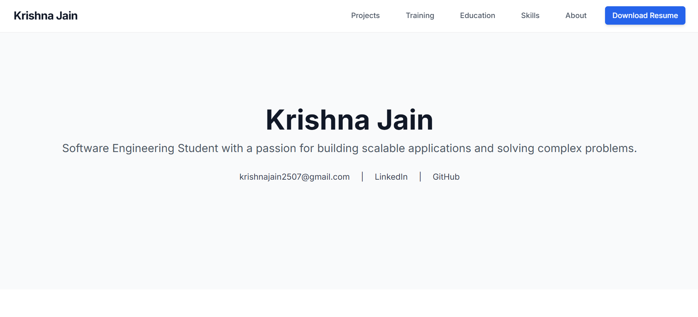
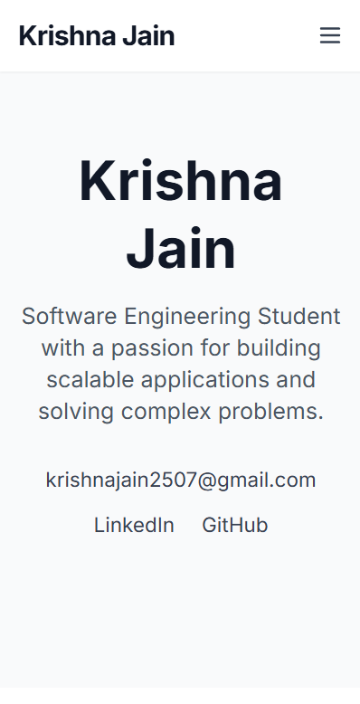

# Krishna Jain – Portfolio Website

🎯 A modern, responsive, and professional portfolio website showcasing my projects, skills, and journey as a software engineering student.

🔗 **Live Website:** [https://krishna-jain25.github.io/krishna-jain-portfolio](https://krishna-jain25.github.io/krishna-jain-portfolio)  
📄 **Resume:** [Download Resume](./assets/resume/Krishna_Jain_Resume.pdf)

---

## 👋 About Me

I am Krishna Jain, a passionate Computer Science and Engineering student focused on full-stack development, cloud technologies, and data structures & algorithms.  
Currently building scalable, user-friendly web applications and continuously learning to improve my skills.

---

## 🖼 Preview

### Desktop View

<p align="center">
  
</p>

---

### Mobile View

<p align="center">
  
</p>


---

## 🚀 Tech Stack

- HTML5  
- Tailwind CSS  
- JavaScript  
- GitHub Pages (deployment)

---

## 🔧 Features

- 📱 Fully responsive design — optimized for desktop and mobile  
- 🎨 Clean, minimal, and professional UI  
- 🧠 Highlights core technical skills and key projects  
- 📄 Downloadable one-page resume  
- 🌐 Direct links to GitHub and LinkedIn  

---

## 🛠️ Getting Started

To run this project locally, follow these steps:

1. **Clone the repository to your local machine:**
   ```bash
   git clone https://github.com/Krishna-Jain25/krishna-jain-portfolio.git
    ```

2. **Navigate into the project directory:**

   ```bash
   cd krishna-jain-portfolio
   ```

3. **Open the `index.html` file in your web browser.**

   * You can double-click the file, or
   * Right-click → "Open with" → choose your browser

---

## 📫 Connect With Me

* ✉️ [krishnajain2507@gmail.com](mailto:krishnajain2507@gmail.com)
* 🔗 [LinkedIn](https://www.linkedin.com/in/krishna-jain-62b2bb348/)
* 💻 [GitHub](https://github.com/Krishna-Jain25)

---

## ⚡ License

This project is open source under the [MIT License](LICENSE).

---